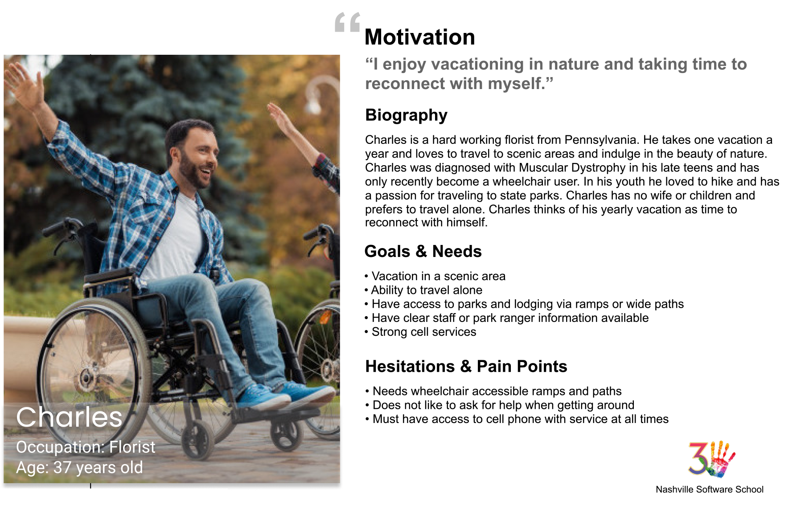

# Wheels on the Ground - A Demo Project for Nashville Software School Cohort 47

## King's Canyon Folks Group Members

- Laurel Morrison
- Salma Crank
- Dakota Upchurch
- Chad Clark (myself)

My teammates and I were tasked with building an application for the National Parks Service that will allow people to build itineraries for their trips to the beautiful national parks that they maintain. The starting point of each trip will be Nashville, TN, but the destination will a national park selected by the user. Our target persona whos story we focused on was Charles, a wheelchair bound young man with a strong will to visit parks on his own. He would like to have good contact information, cell service and accessibility.

## My contributions

For this project I worked with the weather API from openweather.com to get a  5 day weather forecast for the park seleceted based on the coordinates of the park. I took the data and decoded the timestamp and extracted min and max temperatures, projected conditions and added icons from open weather based on the weather conditions. This information was displayed on the DOM in an aside Itinerary Preview. 
I also made the API for saving the itineraries and collecting the selected Park, eatery and attraction objects to be saved to the database as an itinerary.
I worked on the logic to disable the save button until all items were selected and then to save once they were filled out including naming each itinerary.

## Tech Stack and Processes

This project was built with Javascript, HTML5 and CSS3. We used 4 different APIs to gather data and then used our own API to save the data to a database. This project was also focused on using a Scrum framework for agile development. For this sprint we did daily Scrum Standups, with sprint reviews and a retrospective at the end of the sprint.

## To use: You will need API keys for the nps and openweather apis . These will be saved in a Settings.js file that can be copied from Settings.js.example with your api keys inserted into the double quotes.
You will need to serve up the page and also from the api folder run:  
    json-server -p 8088 -w db.json

## Feature List

### Building the Itinerary

* List all national parks in a dropdown. When user chooses one, display the name of the park in the **Itinerary Preview** section.

* List all bizarraries in a dropdown. When user chooses one, display the name of the bizarre attraction in the **Itinerary Preview** section.

* List all eateries in a dropdown. When user chooses one, display the name of the eatery in the **Itinerary Preview** section.

### Itinerary Details

* In the **Itinerary Preview** section, there should be a button labeled _Save Itinerary_. It should be disabled by default.
* When the user has selected a park, and the name of the park has been added to the **Itinerary Preview** section, query the Open Weather API and display the 5 day forecast for that location. This will allow the user to see if they want to make the trip soon.
* When the user adds any item to the **Itinerary Preview**, there should be a _Details_ button next to the name of the item.

* When the user clicks on any detail button for an itinerary item, a dialog box should be presented to the user with more information about that item _(description, address, etc...)_.
* Once the user has selected a park, a bizarre attraction, and an eatery, the _Save Itinerary_ button should be enabled.
* When the user clicks the _Save Itinerary_ button, the chosen items should be saved as an object in your own, local API that is managed by `json-server`. Each saved itinerary should appear in an aside bar on the right side of the UI.

## API Keys

All API keys should be added to `Settings.js`. Once again, **_DO NOT MODIFY Settings.js.example!_**

## Accessing the API keys

In any module where you need your API keys,

```js
import { settings } from "./Settings.js"

// Since settings is an object, you can use dot notation or square bracket notation to access the properties.
settings.npsKey
settings["weatherKey"]
```


## National Park Service API

* API home: https://www.nps.gov/subjects/digital/nps-data-api.htm
* API documentation: https://www.nps.gov/subjects/developer/api-documentation.htm

### List All Parks

https://developer.nps.gov/api/v1/parks?api_key=your_api_key

## Weather API

https://openweathermap.org/api

## Bizarre Destination

http://holidayroad.nss.team/bizarreries

## Eateries Destination

http://holidayroad.nss.team/eateries


## Tips For A Good Usable Website
1. Use acceptable conventions
   * Logo positioned at top left
   * Navigation across the top or down the left side
   * Copyright in the footer.
2. Visual hierarchy
   * Most important information is the most prominent
3. Break pages up into defined sections
   * Logically related content should be related visually
4. That which is clickable should be obviously clickable.
5. Eliminate distractions
   * Use only two typefaces
   * Limit color pallet (3 colors with black and white)
   * Use a grid
6. Support scanning (users don't read)
   * Use plenty of headings
   * Short paragraphs
   * Bulleted lists
   * Left aligned text
7. Strive for consistency.
8. Use semantic and valid HTML: validator at [https://validator.w3.org/](https://validator.w3.org/).

## Persona

## Charles



